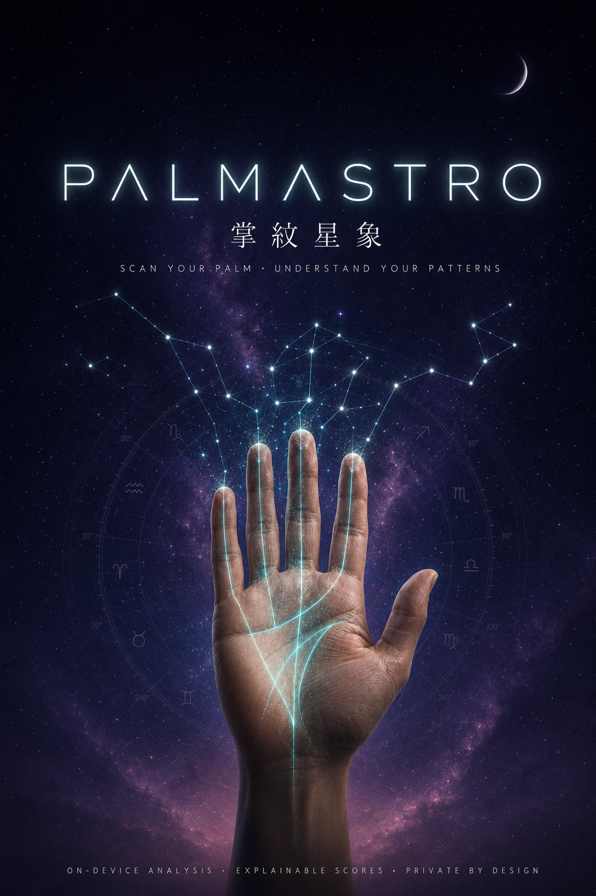

<div align="center">



# PalmAstro · 掌紋星象

**Scan your palm. Understand your patterns. Track your growth.**

A privacy-first self-reflection app that reads your palm **entirely on your device**, blends it with
tropical astrology, and turns the result into explainable, action-oriented monthly guidance —
what to lean into, and what to be mindful of.

[](https://github.com/bohueilin/palmastro/actions/workflows/ci.yml)
&nbsp;·&nbsp; Android (Kotlin · Compose) &nbsp;·&nbsp; iOS (Swift · SwiftUI)
&nbsp;·&nbsp; English + 繁體中文

</div>

---

## Why it's different

| | |
|---|---|
| 🔒 **On-device, always** | Camera frames, palm features, birthday, journal — nothing leaves the phone. Encrypted local database, raw scans auto-delete in 24 h, one-tap delete-everything. |
| 🧮 **Explainable, not mystical** | Every score opens a *"How was this calculated?"* breakdown — real signal contributions, confidence, and quality factors. No black boxes. |
| 🌱 **Guidance, not fortune-telling** | Each month distills into strengths to lean into, gentle points to be mindful of, and a week-by-week focus plan. Calm by design: no fear, no doom, no medical or financial claims — enforced by a safety filter on every generated sentence. |
| 📈 **A ritual, not a reading** | Monthly rescans track how your patterns shift, with honest comparability scoring that hides deltas it can't stand behind. |

## How it works

```
📷 7-angle palm scan ─→ ✋ on-device landmarks + line metrics ─→ 🔢 deterministic scoring
                                                                        │
🌙 tropical astrology (real Meeus math) ────────────────────────────────┤
                                                                        ▼
                          🛡 safety filter ←─ 📝 localized content engine (versioned JSON)
                                                                        │
                                                                        ▼
                                    🧭 monthly guidance · explainability · journal
```

Both platforms run the **same brain**: the ruleset, content templates, and safety rules are shared
JSON, and cross-platform parity fixtures prove the Kotlin and Swift engines produce identical
output — to the signal, to the sentence.

## Try it

**Android** (5 minutes with a device, ~15 with an emulator):

```bash
git clone https://github.com/bohueilin/palmastro.git && cd palmastro
export JAVA_HOME=$(/usr/libexec/java_home -v 17 2>/dev/null || echo /opt/homebrew/opt/openjdk@17/libexec/openjdk.jdk/Contents/Home)
./gradlew :app:assembleDebug
adb install app/build/outputs/apk/debug/app-debug.apk
```

**iOS** (requires a Mac with Xcode 15.4+):

```bash
brew install xcodegen
cd ios && xcodegen generate && open PalmAstro.xcodeproj   # run on a simulator or device
```

**Engines only** (no device needed — runs the full analysis brain + tests):

```bash
./gradlew test                          # Android: all 10 modules
cd ios/PalmAstroKit && ./test.sh        # iOS: 163 tests incl. cross-platform parity
```

📖 Full walkthrough, emulator setup, and troubleshooting: **[docs/launch/LOCAL_BUILD.md](docs/launch/LOCAL_BUILD.md)**

## Project map

| Path | What lives there |
|---|---|
| `app/` | Android app (Compose, Material 3) |
| `engine-*/` | Deterministic analysis engines — scan quality, palm features, astrology, scoring, content |
| `contracts/` | Frozen cross-platform data contracts |
| `ios/PalmAstroKit/` | Swift engine package (SPM, macOS-testable) + SwiftUI app source |
| `ios/shared-fixtures/` | Parity fixtures generated by the Kotlin engines, replayed in Swift |
| `docs/store/` | Play & App Store readiness: listings, Data Safety, review notes, screenshot plan |
| `docs/launch/` | Execution spec, UX roadmap, local build guide |
| `PalmAstro_PRD_Full_v2_AppStoreLaunch.md` | The product Source of Truth |

## Principles

1. **Privacy is the product.** No accounts, no ads, no tracking, no cloud inference.
2. **Honesty over mystery.** Reflective guidance framed as awareness — never diagnosis, prediction, or investment advice.
3. **One brain, two native bodies.** Shared JSON contracts; platform-native Material 3 and Human Interface experiences.

---

<div align="center">
<sub>Poster artwork prompt: <a href="docs/assets/POSTER_PROMPT.md">docs/assets/POSTER_PROMPT.md</a> · Status: pre-release (closed-testing ready)</sub>
</div>
